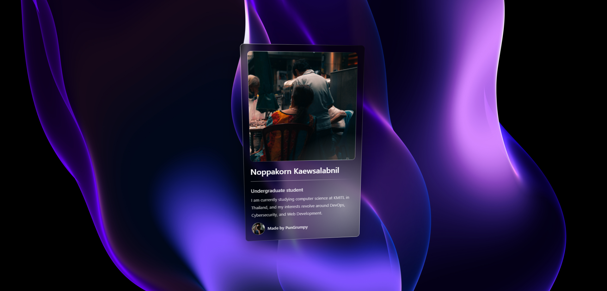

# Shiny Card

Shiny Card is website that built with ReactJS, Styled Components and ChatGPT-4. It's a website that built for fun and for learning purpose.

## Demo

## Tech Stack

- [ReactJS](https://reactjs.org/)
- [Styled Components](https://styled-components.com/)
- [ChatGPT-4](openai.com/blog/chatting-with-gpt-4/)

## How to run

1. Clone this repository
2. Install all dependencies on the package.json using `npm install` or `yarn install`
3. Run the development server using `npm run start` or `yarn start`

## How to build

1. Clone this repository
2. Install all dependencies on the package.json using `npm install` or `yarn install`
3. Run the build script using `npm run build` or `yarn build`

## License

- [MIT](./LICENSE)
- [Meng To](https://twitter.com/MengTo)
